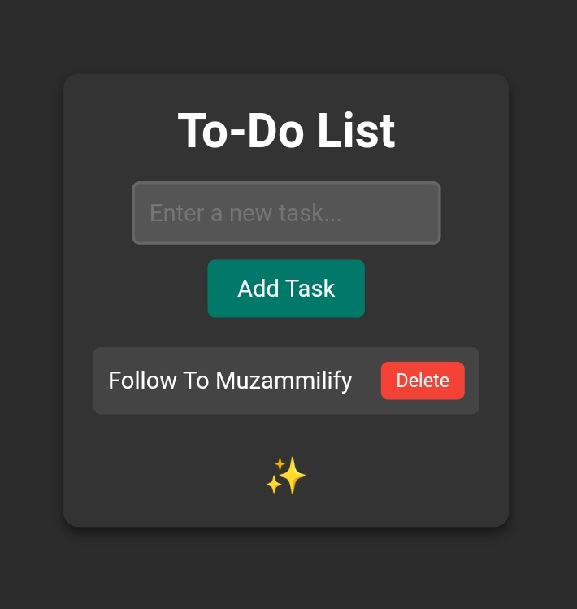

# Simple To-Do List App

A simple, beautiful To-Do List app built with HTML, CSS, and JavaScript. This app allows you to add, complete, and delete tasks. It also includes a theme toggle button (sparkle icon) to switch between light mode and dark mode.

## Features

- **Add Tasks**: Easily add tasks to your to-do list by typing in the input field and clicking the "Add Task" button.
- **Complete Tasks**: Mark tasks as completed by clicking on them (strikes through the text).
- **Delete Tasks**: Remove tasks by clicking the "Delete" button next to them.
- **Theme Toggle**: Switch between light mode and dark mode by clicking the sparkle icon (`✨`) in the bottom-right corner.

## Demo

You can preview the To-Do List app in action by cloning the repository and opening the `index.html` file in your browser.

## Technologies Used

- **HTML**: For structuring the content of the app.
- **CSS**: For styling and creating the beautiful interface, including the light and dark theme styles.
- **JavaScript**: For adding interactivity, such as adding, removing, and toggling tasks, and switching between themes.

## How to Use

1. **Clone the repository**:
   ```bash
   git clone https://github.com/your-username/to-do-list-app.git

2. Open the index.html file: Open index.html in any web browser to run the app.


3. Add tasks: Type a task in the input field and click the "Add Task" button to add it to your to-do list.


4. Complete tasks: Click on a task to mark it as completed (striking through the text).


5. Delete tasks: Click the "Delete" button next to any task to remove it from the list.


6. Toggle themes: Click the sparkle icon (✨) in the bottom-right corner to switch between dark mode and light mode.


How It Works

Theme Toggle: The sparkle icon (✨) allows users to toggle between light and dark modes. When clicked, it adds or removes a dark-mode class to the body and various elements within the app. This changes the background color, text color, and button styles, providing a smooth transition between the two themes.

In light mode, the app has a bright background and dark text, making it easier to read in well-lit environments.

In dark mode, the app switches to a darker background with lighter text, providing a more comfortable viewing experience in low-light settings.


Task Management:

Users can add new tasks by typing into the input field and clicking the "Add Task" button. Each task is added as an item in an unordered list (<ul>).

Tasks can be marked as completed by clicking on the task. This adds a completed class, which strikes through the text and changes the background color to indicate it's done.

Users can delete tasks by clicking the "Delete" button next to each task. This removes the task item from the DOM.


Task Persistence: The app does not store tasks after a page refresh, as the tasks are saved only in the DOM. You could extend the app to persist tasks using localStorage or a backend server, but this current version keeps things simple for demonstration purposes.


Preview Screenshot
